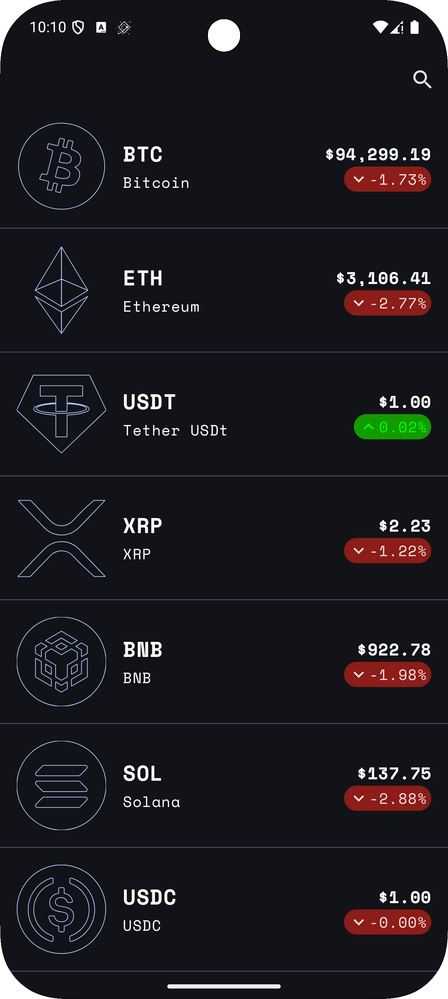
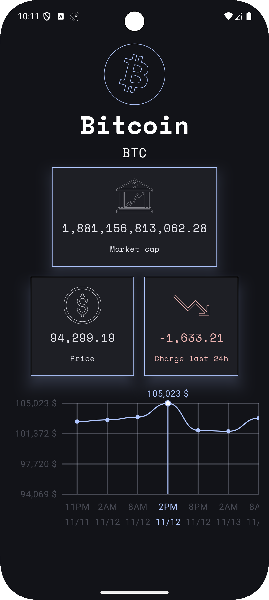
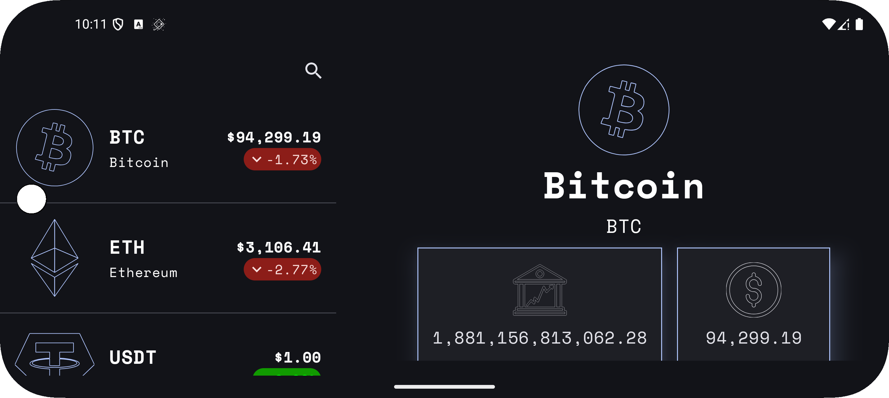

# CryptoTracker

A small Android app for checking crypto prices—simple, fast, and built with modern Android tools.

---

## Overview

CryptoTracker shows a list of cryptocurrencies and a detail screen with a price-history chart.  
Data comes from CoinCap (configured in Gradle), then cached locally with Room so the app stays responsive even on slow networks.  
On larger screens, it uses an adaptive list–detail layout.

---

## Screenshots

> Replace the image paths with real files once you add them to the repo.

<p align="center">
  
  
  
</p>

---

## What’s Inside

- **Jetpack Compose + Material3** — full Compose UI, including adaptive layouts.  
- **Ktor (CIO) + Kotlinx Serialization** — lightweight networking; no Retrofit/OkHttp.  
- **Koin** — simple dependency injection.  
- **Room** — persists coins + price history.  
- **Coroutines + Flow** — async + reactive data handling.  
- **Not used on purpose**: Hilt, Dagger, Retrofit, OkHttp, Coil.

---

## Project Structure

### App Startup & DI
- `CryptoTrackerApp.kt` — starts Koin.  
- `AppModule.kt` — provides HttpClient, Room DB, DAOs, repository, and ViewModels.

### Networking
- `HttpClientFactory.kt` — builds the Ktor client.  
- `RemoteCoinsDataSource.kt` — sends API requests.

### Local Storage (Room)
- `CoinsDataBase.kt` — Room DB.  
- DAOs: `CoinsDao`, `CoinPricesDao`.  
- Entities: `LocalCoinDto`, `LocalCoinPriceDto`.

### UI (Compose)
- `MainActivity.kt` — entry point.  
- List screen: `coins_list/`  
- Detail screen & chart: `coin_detail/`

#### Custom LineChart (Canvas)

This project includes a custom, hand-written `LineChart` component implemented directly on a Compose `Canvas`. It's used on the coin detail screen to render a smooth, scrollable price history and supports tap-to-select for individual data points.

- File: `app/src/main/java/com/serag/cryptotracker/crypto/presintation/coin_detail/components/LineChart.kt`
- Used from: `app/src/main/java/com/serag/cryptotracker/crypto/presintation/coin_detail/CoinDetailScreen.kt`

Key features
- Draws a smoothed line (cubic curves) through the price points.
- Renders X and Y labels, helper grid lines, and a selected-value callout above the chart.
- Supports horizontal scrolling when the computed chart width exceeds the viewport.
- Detects taps on plotted points to select/deselect a data point (via touch gestures) and exposes selection events to the caller via `onSelectedDataPoint`.
- Preview composable included for quick visual checks.

Public API (important parameters)

```
LineChart(
    modifier: Modifier = Modifier,
    style: ChartStyle,
    dataPoints: List<DataPoint>,
    visibleDataPointsIndices: IntRange,
    unit: String,
    selectedDataPoint: DataPoint? = null,
    onSelectedDataPoint: (DataPoint?) -> Unit = {},
    onXLabelWidthChange: (Float) -> Unit = {},
    showHelperLines: Boolean = true,
)
```

Notes on types and usage
- `DataPoint` represents a plotted point and includes `x`, `y`, and `xLapel` fields; convert your `CoinPrice` history using `toDataPoint()` before passing it to `LineChart`.
- `ChartStyle` configures chart colors, label font size, paddings, and helper/axis thickness values.
- Typical usage: map `CoinPrice` history to `DataPoint`s, choose the visible index range (window), place `LineChart` inside a horizontally scrollable container, and handle `onSelectedDataPoint` to react to taps.

Example (in `CoinDetailScreen`)
- The `selectedCoin.priceHistory` is converted to `DataPoint`s and passed to `LineChart`. The screen listens to selection callbacks to display the selected price and label.

---

### Repository & Domain
- `CryptoRepository.kt` — merges remote + local sources.  
- Domain models under `crypto/domain/`.

---

## API Setup

`BASE_URL` is defined in `build.gradle.kts`.

If your API needs a key, add it to `local.properties`:

```
API_KEY=your_api_key_here
```

The app automatically sends it as a bearer token if it exists.

---

## Build & Run

### Android Studio
Open → Run.

### Terminal (fish)

```fish
./gradlew assembleDebug
./gradlew installDebug
```

---

## Local Data

Room stores:

- **LocalCoinDto** — coin details (name, price, rank, market cap, etc.).  
- **LocalCoinPriceDto** — timestamped price history.

DB name: `coins_db`.

---

## Data Flow

1. `CoinsListViewModel` manages fetch + exposes state via Flow.  
2. `CryptoRepository` fetches using Ktor → stores in Room.  
3. UI observes ViewModel state and updates list/detail UI.  
4. Price history comes straight from the local DB.

---

## Notes

- After editing Room entities or DAOs, run a clean build for KSP to regenerate sources.  
- If you want coin icons, add Coil and update the composables.  
- If you prefer navigation routes, replace the adaptive scaffolding with Navigation Compose.

---

## Contributing

PRs and issues are welcome. For anything big, open an issue first.

---

## License

MIT (if included).

---

## Thanks

Dependency versions live in:  
`app/build.gradle.kts` and `gradle/libs.versions.toml`.
